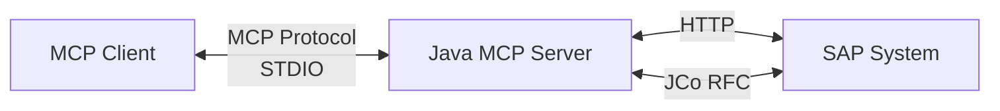
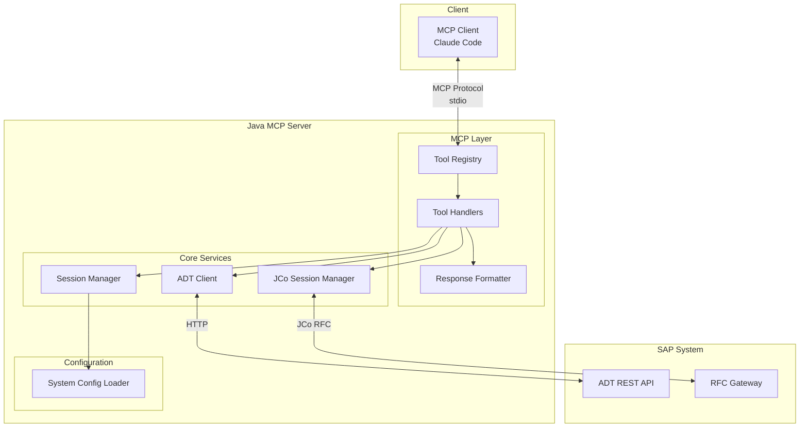

# Architecture

Single-process Java MCP server with Spring Boot and JCo integration.

## Overview

- **Java MCP Server** (Spring Boot) - Full MCP protocol implementation via STDIO
- **JCo Integration** - Stateful SAP session management via RFC
- **ADT REST Client** - HTTP calls to SAP ADT REST API



## Communication Paths

- **Read operations** (GetClass, Search, etc.): HTTP calls to SAP ADT REST API
- **Write operations** (SaveClass, SaveProgram, etc.): JCo for session management, HTTP to ADT REST API

---

## Detailed Architecture

Component-level view:



## Component Descriptions

| Component | Description |
|-----------|-------------|
| **Tool Registry** | Registers and routes MCP tool calls to handlers |
| **Tool Handlers** | MCP tool implementations (61 handlers) |
| **Response Formatter** | Formats responses as MCP-compliant JSON |
| **Session Manager** | Tracks active editing sessions and their bound SAP systems |
| **ADT Client** | Makes HTTP calls to SAP ADT REST API with CSRF token management |
| **JCo Session Manager** | Maintains stateful JCo connections for atomic operations |
| **System Config Loader** | Loads multi-system configuration from `.sap-systems.json` |

## Data Flow Examples

**Read Operation (GetClass):**
```
Claude Code → MCP Server → ADT Client → SAP ADT REST API
```

**Write Operation (SaveClass):**
```
Claude Code → MCP Server → JCo Session Manager → ADT Client → SAP ADT REST API
                              ↓
                       (lock → save → unlock)
```

## Key Directories

- `jco-service/src/main/java/com/sapjco/mcp/handlers/` - MCP tool handlers (61 handlers)
- `jco-service/src/main/java/com/sapjco/mcp/service/` - Core services (AdtClient, JcoSessionManager)
- `jco-service/src/main/java/com/sapjco/mcp/mcp/` - MCP infrastructure (McpToolRegistry, McpResponseFormatter)
- `jco-service/src/main/java/com/sapjco/mcp/config/` - Configuration (SystemConfigLoader)

## Handler Categories

| Category | Handlers | Description |
|----------|----------|-------------|
| system | 5 | System management (ListSystems, Add/Remove/Update) |
| session | 3 | Session lifecycle (Create/Destroy/List) |
| write | 11 | Save operations for all ABAP objects |
| read | 25 | Get source code, search, where-used, field info |
| transport | 3 | Transport request management |
| testing | 3 | ABAP Unit and ATC |
| data | 3 | Table/CDS data preview |
| debug | 9 | Debug session management |
| bopf | 1 | BOPF business object metadata |

## Session Flow

```
CreateSession → SaveClass (session_id) → ActivateObject (session_id) → DestroySession
```
