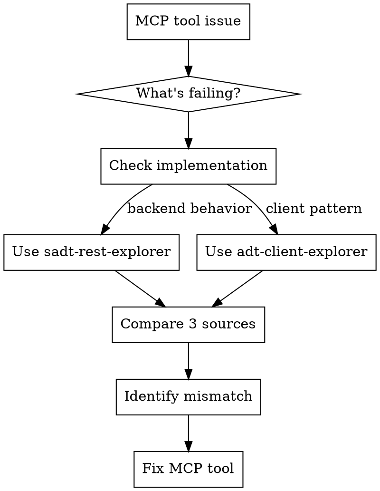

# MCP Tool Insight

---
name: mcp-tool-insight
description: Use when debugging failing SAP ADT MCP tools, implementing new tools, or when tools return unexpected results, errors, or wrong content types. Use when you need to understand what the backend expects or how Eclipse ADT implements similar functionality.
model: opus
---

## Overview

**Debug and implement SAP ADT MCP tools by comparing three sources: your MCP implementation, Eclipse client reference, and backend ABAP expectations.**

Core principle: Don't guess—check how Eclipse does it and what the backend expects.

## When to Use

- MCP tool returns errors (400, 404, 405, 500)
- Empty or unexpected results
- Content type mismatches (XML vs JSON)
- CSRF token failures
- Request/response format issues
- Implementing new MCP tool
- Understanding backend expectations

## Diagnostic Framework



## Three-Source Comparison

Always check:

| Source | Purpose | How to Access |
|--------|---------|---------------|
| **MCP Tool** | Current implementation | Read handler in `src/handlers/handle*.ts` |
| **Eclipse Client** | Reference implementation | Use **adt-client-explorer** agent |
| **Backend ABAP** | Expected behavior | Use **sadt-rest-explorer** agent |

## Investigation Patterns by Error Type

### Empty/Missing Results

**Check:**
1. **MCP**: What parameters are being sent?
2. **Eclipse**: How does client construct request? (use adt-client-explorer)
3. **Backend**: What parameters are required? (use sadt-rest-explorer)

**Example:**
```
GetTransportRequests returns empty
→ Check Eclipse client: AdtTransportService.java
→ Find: Always sends DEVCLASS parameter
→ Check backend: CL_ADT_REST_CTS classes
→ Find: DEVCLASS required for transport check
→ Fix: Add package parameter to MCP request
```

### Content Type Errors

**Check:**
1. **MCP**: What Accept/Content-Type headers sent?
2. **Eclipse**: How does client select content handler? (IContentHandler pattern)
3. **Backend**: What content handlers are available? (CL_ADT_REST_CNT_HDL_FACTORY)

**Example:**
```
"Unexpected token '<'" error
→ Eclipse: AbstractRestResource uses content negotiation
→ Backend: Multiple handlers (JSON, XML, Atom)
→ MCP: Check Accept header matches expected response type
```

### CSRF Token Failures

**Check:**
1. **MCP**: Is session ID passed correctly?
2. **Eclipse**: Session affinity pattern (LockRequestUtil.java)
3. **Backend**: Token validation (CX_ADT_REST_CSRF_TOKEN)

**Pattern:**
```typescript
// Eclipse pattern: Session-specific tokens
const session = await sessionManager.getSession(sessionId);
const resource = factory.createResource(uri, session);
```

### 404/405 Errors

**Check:**
1. **MCP**: What URI is being constructed?
2. **Eclipse**: Object-specific URI pattern
3. **Backend**: Endpoint structure (discovery document)

**Key Pattern:**
```
Classes:    /sap/bc/adt/oo/classes/{name}
Programs:   /sap/bc/adt/programs/programs/{name}
Interfaces: /sap/bc/adt/oo/interfaces/{name}
```

## Agent Usage

### sadt-rest-explorer

**Use for:**
- Understanding backend ABAP classes
- Exception hierarchy
- Content handler expectations
- Response format structure

**Example:**
```
Task: Use sadt-rest-explorer agent
Prompt: "How does the backend handle transport checks?
Search for transport-related classes in SADT_REST and
explain the request format expected by CTS endpoints."
```

### adt-client-explorer

**Use for:**
- Eclipse client implementation patterns
- Request construction
- Session management
- Content handler selection
- CSRF token patterns

**Example:**
```
Task: Use adt-client-explorer agent
Prompt: "How does Eclipse ADT client save ABAP programs?
Find the program save implementation and show the
request format, headers, and session handling."
```

## Implementing New Tools

**Process:**
1. **Check existing similar tool** in MCP codebase
2. **Use adt-client-explorer**: Find Eclipse implementation
3. **Use sadt-rest-explorer**: Understand backend endpoint
4. **Compare patterns**: URI, headers, request body, response handling
5. **Implement**: Follow object-specific pattern

**Example - SaveProgram:**
```typescript
// 1. Check SaveClass implementation (similar tool)
// 2. Eclipse: AdtProgramService.java → endpoint structure
// 3. Backend: Program endpoints in SADT_REST
// 4. Pattern: /sap/bc/adt/programs/programs/{name}/source/main
// 5. Implement with same session/lock patterns as SaveClass
```

## Common Mistakes

| Mistake | Fix |
|---------|-----|
| Guessing request format | Check Eclipse client implementation |
| Ignoring backend exceptions | Use sadt-rest-explorer to understand error hierarchy |
| Wrong content type | Compare Eclipse content handler selection |
| Missing parameters | Check Eclipse client parameter building |
| Generic object URIs | Use object-specific URIs (classes vs programs) |
| Skipping session affinity | Follow Eclipse LockRequestUtil pattern |

## Testing Changes

**CRITICAL: After making code changes, you must restart Claude Code to test MCP tools.**

The MCP server runs as a subprocess. Changes to tool implementations only take effect after:
1. Build the changes: `npm run build:node`
2. Ask the user to restart Claude Code (exit and reopen)
3. Test the tool again in the new session

**Do NOT** try to test tools in the same session after making changes - you will be testing the old code.

## Quick Reference

**First steps for any MCP tool issue:**
1. Read MCP handler code
2. Identify error type (empty, error code, content type)
3. Launch appropriate agent (backend or client)
4. Compare implementations
5. Fix mismatch
6. Build and restart Claude to test

**Red flags to investigate with agents:**
- Any 400/404/405 error → Check Eclipse request format
- Content type mismatch → Check Eclipse content handlers
- Empty results → Check Eclipse parameter building
- CSRF failures → Check Eclipse session affinity
- New tool → Check both Eclipse and backend

## Real-World Example

**Problem**: GetTransportRequests returns empty

**Investigation:**
1. ✅ Read handler → Found empty DEVCLASS
2. ❌ Should have checked Eclipse client first
3. ❌ Should have checked backend expectations

**Better approach:**
```
1. Use adt-client-explorer:
   "How does Eclipse get transport requests?"
   → Find: Always includes package parameter

2. Use sadt-rest-explorer:
   "What does backend transport check API expect?"
   → Find: DEVCLASS required parameter

3. Fix MCP: Add package parameter
```

## Key Insight

**Trial-and-error works for simple issues. Reference implementations are faster and more reliable for complex ones.**

Always check:
- How Eclipse does it (proven working implementation)
- What backend expects (authoritative source)
- Your MCP code (what's different)
